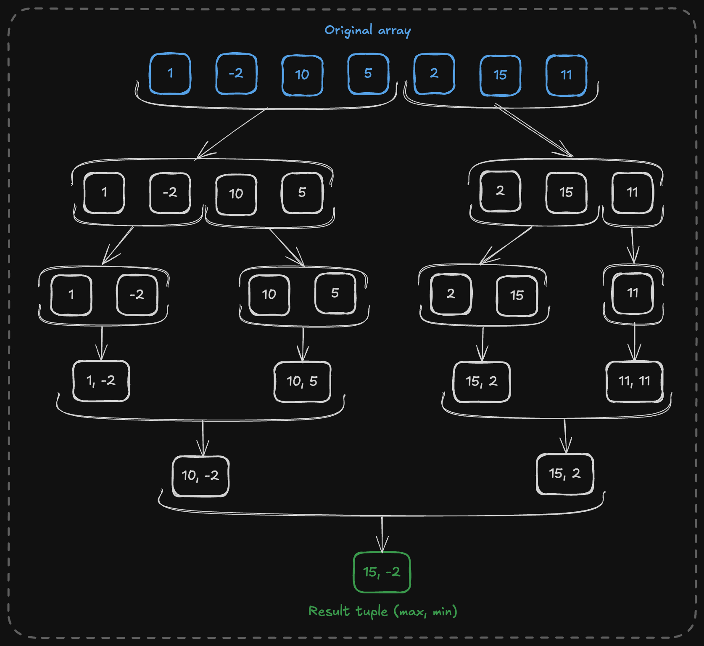
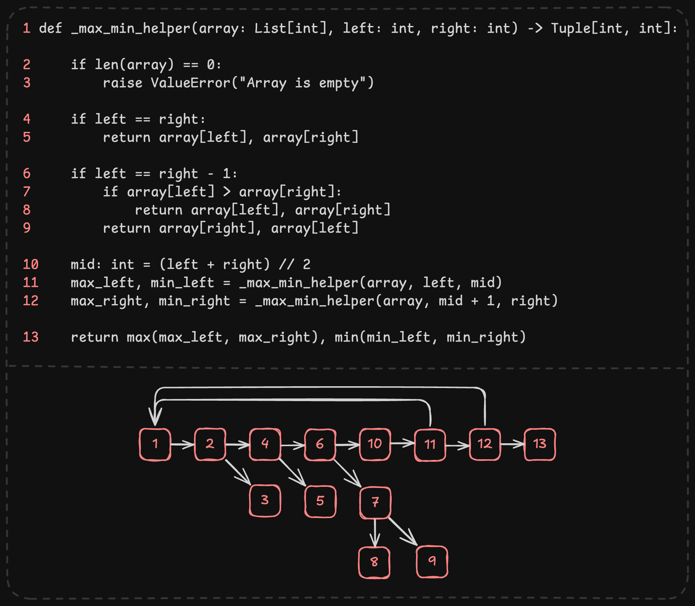

# Max-Min Selection Algorithm

Simple Python implementation of an algorithm to find the maximum and minimum values in an array.

This was built as an assignment for the **Foundations of Algorithm Design and Analysis** course at the PUC Minas university.

# About

The Max-Min Selection algorithm is a method to find both the maximum and minimum values in an array using a divide-and-conquer approach. This method is efficient and reduces the number of comparisons needed compared to the naive approach.

The algorithm works by recursively splitting the array into halves, finding the maximum and minimum values in each half, and then combining the results. This approach ensures that the number of comparisons is minimized, making it more efficient for large arrays.

# Structure

This repository contains three `.py` files:

- `maxmin.py`: Contains the implementation of the Max-Min Selection algorithm.
- `test_maxmin.py`: Contains unit tests for the Max-Min Selection algorithm.
- `main.py`: Contains an example of how to use the Max-Min Selection algorithm.

# How to run

You need to have Python 3 installed on your machine to run the code.

To run the example program, you can use the following command:

```bash
python3 main.py
```

To run the unit tests, you can use the following command:

```bash
python3 test_maxmin.py
```

# Divide and conquer approach

The diagram below illustrates the [divide and conquer](https://en.wikipedia.org/wiki/Divide-and-conquer_algorithm) approach used by the Max-Min Selection algorithm.


Excalidraw source available [here](misc/divide-and-conquer.excalidraw).

# Control flow graph


Excalidraw source available [here](misc/cyclomatic-complexity.excalidraw).

## Cyclomatic complexity

Considering `𝑀 = 𝐸 − 𝑁 + 2𝑃`, where 𝐸 is the number of edges (14), 𝑁 is the number of nodes (13), and 𝑃 is the number of connected components (1), the cyclomatic complexity of the Max-Min Selection algorithm is **3**.

## Asymptotic complexity

### Operation Count Method

The algorithm recursively divides the array into two halves until the sublists contain only one or two elements. For each division, it performs comparisons to combine the maximum and minimum values from each half.

- **Divide**: The array of size `n` is divided into two halves of size `n/2`.
- **Combine**: After each recursive call, only **2** comparisons are needed to combine the results from both halves.

So, the total number of comparisons `C(n)` can be described by the following recurrence:

```mathematica
C(n) = C(n/2) + C(n/2) + 2 for n > 2
C(2) = 1 (base case: one comparison between two elements)
C(1) = 0 (base case: a single element is both min and max)
```

**Solving**:  
Each division creates two subproblems with `n/2` elements each.  
Each merge step does **2** constant-time comparisons.

Thus, we get:

```mathematica
C(n) = 2 * C(n/2) + 2
```

From this pattern, the total number of comparisons grows linearly with the size of the input, so the time complexity is **O(n)**.

---

### Master Theorem

The recurrence has the form:

```mathematica
T(n) = 2T(n/2) + O(1)
```

Comparing with the standard Master Theorem form:

```mathematica
T(n) = aT(n/b) + O(n^d)
```

We have:

- a = 2
- b = 2
- d = 0 (since the additional work outside the recursive calls is constant, O(1))

Now calculating `log_b(a)` we get:

```mathematica
log₂(2) = 1
```

Since `d = 0 < 1`, we fall into **Case 1** of the Master Theorem.

Thus, the complexity is:

```mathematica
T(n) = O(n^1) = O(n)
```

---

### Summary

- **Best case**: O(n)  
- **Worst case**: O(n)  
- **Average case**: O(n)
